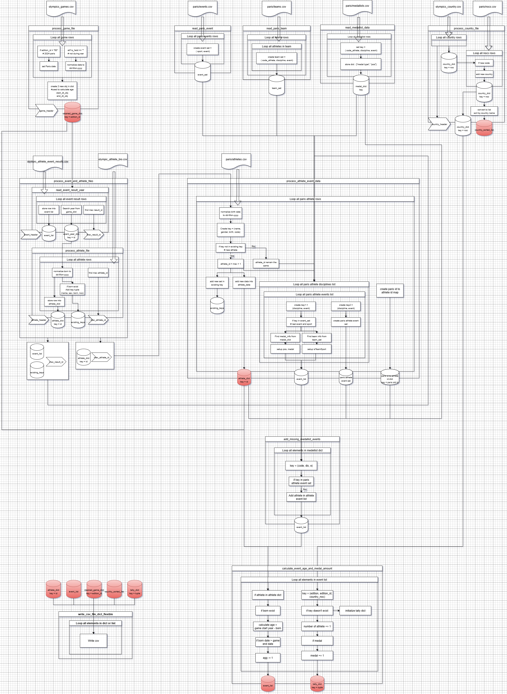

# Olympics Data Cleaning and Integration Project

##📌 Overview
This project processes large Olympic open datasets, integrates the Paris 2024 data, cleans inconsistencies, and generates updated, tabulated CSV outputs.
The final deliverables include cleaned datasets and a medal tally summary across all Olympic editions.

This project is part of the semester assignment, where the goal is to design, implement, and analyze a Python application that cleans, organizes, and extracts insights from open data — without using libraries like pandas.

## ⚙️ Features & Tasks

The application performs the following tasks:
 1. Integrate Paris 2024 Data
    - Append Paris athlete, event, and country data to existing datasets.
	- Prevent duplication of athletes and NOCs.
	- Ensure consistency between IDs across datasets.
 2. Data Cleaning
    - Normalize birthdates in olympic_athlete_bio.csv to dd-Mon-yyyy.
	- Standardize Olympic Games dates in olympics_games.csv.
	- Handle missing, incomplete, and ambiguous values.
 3. Add New Information
    - Compute athlete ages at the time of the Olympics.
	- Fill missing Paris medal events.
	- Generate a medal tally summary with counts of athletes and medals by country.
 4. Generate New Output Files
    - new_olympic_athlete_bio.csv
	- new_olympic_athlete_event_results.csv
	- new_olympics_country.csv
	- new_olympics_games.csv
	- new_medal_tally.csv
# Conceptual Diagram:
   
   
## 🚀 Execution
To run the project:
```
python runproject.py
```

## 📂 Input Data
 - olympic_athlete_bio.csv
 - olympic_athlete_event_results.csv
 - olympics_country.csv
 - olympics_games.csv
 - paris/ (contains Paris 2024 datasets: athletes, events, nocs, teams, medallists)

## 📂 Output Data
 - new_olympic_athlete_bio.csv
 - new_olympic_athlete_event_results.csv
 - new_olympics_country.csv
 - new_olympics_games.csv
 - new_medal_tally.csv

